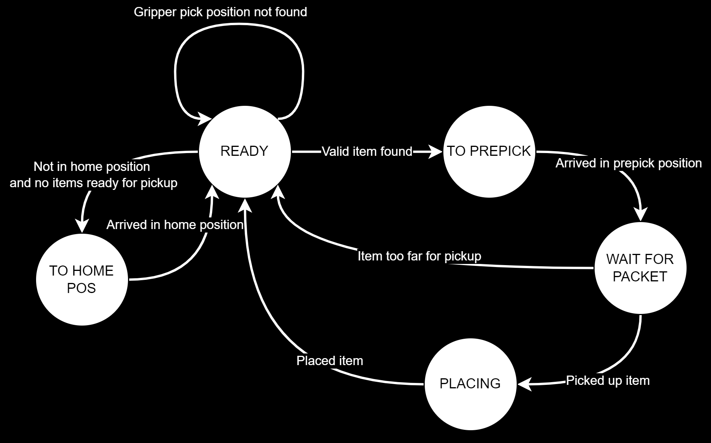
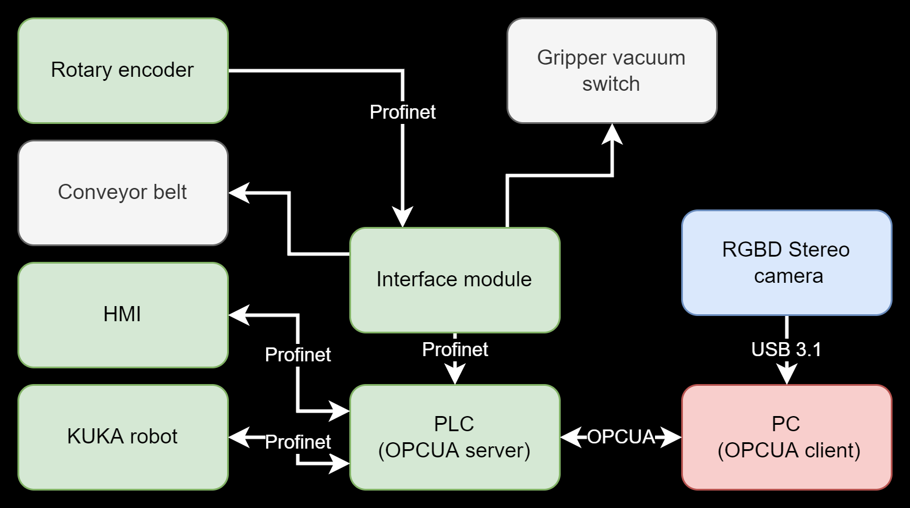

# Cybertech-DeepL-Classifier
_NN detection, classification, localization for KUKA Cybertech for Deep Learning course for CIIRC Testbed for Industry 4.0_

The repository contains a project that is part of the 02456 Deep learning course at **DTU** in collaboration with **CIIRC Testbed for Industry 4.0**. This is a set of experiments to determine a suitable method for real-time detection, classification and segmentation of objects, which will later be integrated into a pipeline controlling an industrial KUKA Cybertech robot.

In order to generate suitable training data, a data synthesis program was developed. This script can be found in the file `GenerateSyntheticDataset.py`. 
The images of the search objects used for data synthesis can be found in the `objects_masks_ordered` folder. The corresponding object masks are located in the `objects_masks_ordered` folder.

A jupyter notebook containing the training and evaluation progress on the selected method (**YOLOv8**) can be found in the file `main.ipynb`. The experimental use of the YOLACT architecture is then in the file `yolact_training.ipynb`.

It is uploaded solely for academic grading and, therefore, does not include original commits and sensitive data.

## Robot system and control
The high level control, coded in Python, utilizes an OPC UA Client that runs on the PC. It includes a finite state machine for the trajectory planning based on visual recognition, which reads sensor and robot data from the OPC UA nodes and sends high level control actions and path trajectory updates to the OPC UA Server on the PLC. These inputs are converted into control instructions using the mx Automation package and are sent to the robot controller via Profinet.

## HW setup
Our setup consists of a KUKA KR Cybertech industrial robot, a PLC, a conveyor belt with rotary encoder and an Intel Realsense RGBD camera. We mounted apriltags on the conveyor for robot workspace detection.

